# Tele-Fleet User Manual

## Document Control
- Document: Tele-Fleet User Manual
- Audience: End users, operations staff, and administrators
- Version: v1.0.0
- Prepared for: Tele-Fleet project
- Prepared by: Operations
- Last updated: January 31, 2026

## Table of Contents
- [Tele-Fleet User Manual](#tele-fleet-user-manual)
  - [Document Control](#document-control)
  - [Table of Contents](#table-of-contents)
  - [1. Introduction](#1-introduction)
  - [2. Roles and Access](#2-roles-and-access)
  - [3. Logging In and Session Behavior](#3-logging-in-and-session-behavior)
    - [3.1 Forgot Password](#31-forgot-password)
    - [3.2 Login Attempt Limits](#32-login-attempt-limits)
  - [4. Navigation Overview](#4-navigation-overview)
  - [4.1 Search and Filters](#41-search-and-filters)
  - [5. Dashboard Overview (by Role)](#5-dashboard-overview-by-role)
    - [5.1 Branch Admin](#51-branch-admin)
    - [5.2 Branch Head](#52-branch-head)
    - [5.3 Fleet Manager](#53-fleet-manager)
    - [5.4 Super Admin](#54-super-admin)
  - [6. Trip Requests](#6-trip-requests)
    - [6.1 Create a Trip](#61-create-a-trip)
    - [6.2 Track a Trip](#62-track-a-trip)
    - [6.3 Cancel Rules](#63-cancel-rules)
    - [6.4 Manage Trips (Fleet Manager/Super Admin)](#64-manage-trips-fleet-managersuper-admin)
  - [7. Trip Approvals and Assignment (Fleet Manager/Super Admin)](#7-trip-approvals-and-assignment-fleet-managersuper-admin)
  - [8. Trip Status, Due, and Overdue Logic](#8-trip-status-due-and-overdue-logic)
  - [9. Logbooks](#9-logbooks)
    - [9.1 Accessing Logbooks](#91-accessing-logbooks)
    - [9.2 Creating a Logbook](#92-creating-a-logbook)
    - [9.3 Managing Logbooks](#93-managing-logbooks)
  - 
  - [10. Incidents](#10-incidents)
    - [10.1 Create an Incident](#101-create-an-incident)
    - [10.2 Status Workflow](#102-status-workflow)
    - [10.3 Manage Incidents (CRUD)](#103-manage-incidents-crud)
    - [10.4 Visibility](#104-visibility)
    - [10.5 Attachments](#105-attachments)
  - [11. Vehicles](#11-vehicles)
    - [11.1 Accessing the Vehicles Page](#111-accessing-the-vehicles-page)
    - [11.2 Create a New Vehicle](#112-create-a-new-vehicle)
    - [11.3 View Vehicle Details](#113-view-vehicle-details)
    - [11.4 Edit or Update a Vehicle](#114-edit-or-update-a-vehicle)
    - [11.5 Delete / Restore (Soft \& Hard Delete)](#115-delete--restore-soft--hard-delete)
    - [11.6 Status \& Badges](#116-status--badges)
  - 
  - [12. Drivers](#12-drivers)
    - [12.1 Accessing the Drivers Page](#121-accessing-the-drivers-page)
    - [12.2 Create a New Driver](#122-create-a-new-driver)
    - [12.3 View Driver Details](#123-view-driver-details)
    - [12.4 Edit or Update a Driver](#124-edit-or-update-a-driver)
    - [12.5 Delete / Restore (Soft \& Hard Delete)](#125-delete--restore-soft--hard-delete)
    - [12.6 Status \& Assignment Rules](#126-status--assignment-rules)
  - [13. Maintenance](#13-maintenance)
    - [13.1 Accessing Maintenance](#131-accessing-maintenance)
    - [13.2 Schedule Maintenance](#132-schedule-maintenance)
    - [13.3 Status Workflow](#133-status-workflow)
    - [13.4 View, Edit, Update](#134-view-edit-update)
    - [13.5 Delete / Restore (Soft \& Hard Delete)](#135-delete--restore-soft--hard-delete)
    - [13.6 Mileage-based Due/Overdue](#136-mileage-based-dueoverdue)
    - [13.7 Filters and Exports](#137-filters-and-exports)
  - [14. Reports](#14-reports)
    - [14.1 My Reports (Branch Users)](#141-my-reports-branch-users)
    - [14.2 Branch Report (Branch Head)](#142-branch-report-branch-head)
    - [14.3 Fleet Reports (Fleet Manager/Super Admin)](#143-fleet-reports-fleet-managersuper-admin)
    - [14.4 Custom Reports](#144-custom-reports)
  - [15. Notifications](#15-notifications)
  - [16. Chat Support](#16-chat-support)
    - [16.1 Who Can Chat With Who](#161-who-can-chat-with-who)
    - [16.2 Start a Support Chat (Branch Users)](#162-start-a-support-chat-branch-users)
    - [16.3 Accept and Respond (Fleet Manager / Super Admin)](#163-accept-and-respond-fleet-manager--super-admin)
    - [16.4 Conversation Status](#164-conversation-status)
    - [16.5 History and Visibility](#165-history-and-visibility)
  - [17. System Tools (Super Admin)](#17-system-tools-super-admin)
    - [17.1 System Health](#171-system-health)
    - [17.2 Database Backups](#172-database-backups)
    - [17.3 System Logs](#173-system-logs)
  - [18. Data Privacy and Branch Isolation](#18-data-privacy-and-branch-isolation)
  - [19. Troubleshooting](#19-troubleshooting)
  - [20. Background Services](#20-background-services)
    - [20.1 Queue Worker](#201-queue-worker)
    - [20.2 Scheduler](#202-scheduler)
    - [20.3 Realtime/Broadcast Server (Reverb)](#203-realtimebroadcast-server-reverb)

---

## 1. Introduction
Tele-Fleet manages trips, vehicles, drivers, incidents, maintenance, and reporting in a single system. This manual explains the end-to-end workflow by role and describes how real-time updates, approvals, and reporting work.

---

## 2. Roles and Access
- **Super Admin**: Full access to all modules, system tools (System Health, Database Backups, System Logs), settings, user management, and restore/force delete actions.
- **Fleet Manager**: Operational control of trips, vehicle/driver assignment, maintenance, logbooks, and fleet reporting.
- **Branch Head**: Branch oversight, branch-level trip reporting, and visibility across branch admins within the same branch.
- **Branch Admin**: Submits trip requests and incident reports for their branch and tracks their own requests.

Access rules are enforced at module and record level. Branch users only see their branch data unless explicitly allowed.

---

## 3. Logging In and Session Behavior
1. Open the login page.
2. Enter your credentials.
3. You will be redirected to your role-specific dashboard.

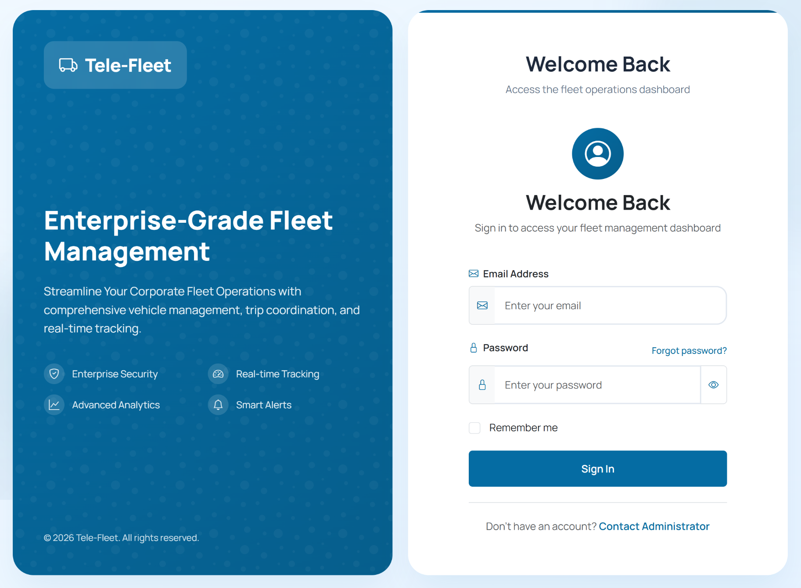

### 3.1 Forgot Password
1. Click **Forgot your password?** on the login page.
2. Enter your registered email address.
3. Check your email for the reset link (and your spam/junk folder if you do not see it) and follow the instructions.
4. Set a new password and log in again.

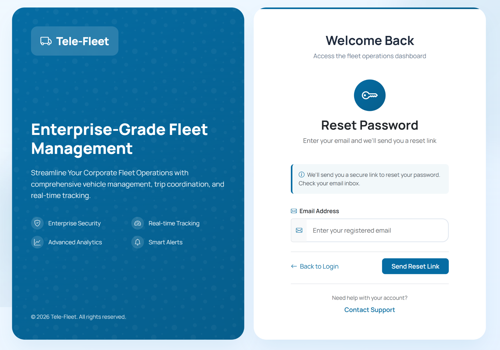

If your session expires, you will be redirected to login and asked to authenticate again.

### 3.2 Login Attempt Limits
For security, the system limits repeated failed logins (3 attempts in 5 minutes). After too many attempts, login is temporarily locked and a lockout message is shown. Wait a few minutes and try again or reset your password if needed.

---

## 4. Navigation Overview
The sidebar menu is role-aware and shows only modules you can access. For super admins, the menu also includes system tools (health, backups, logs) and manual pages.

Key menu sections:
- Core Operations: Trips, Vehicles, Drivers, Incidents, Maintenance, Logbooks
- Reports: My Reports, Branch Report, Fleet Reports, Custom Reports
- Support: Chat, Chat Management (Super Admin)
- System Tools (Super Admin): System Health, Database Backups, System Logs, Maintenance Settings, User Manual

---

## 4.1 Search and Filters
Most tables include a search box and filters:
- Use the **Search** input to quickly find a trip, vehicle, driver, logbook, incident, or report.
- Use **Status** filters or date ranges (where available) to narrow results.
- Pagination controls let you move through long lists.

---

## 5. Dashboard Overview (by Role)
Each role sees a tailored dashboard with live metrics, charts, calendars, and tables.

### 5.1 Branch Admin
- **Cards**: Personal request totals and branch-specific summaries
- **Calendar**: Available vehicles per day (branch view)
- **Charts**: Trip status tracker (current month)
- **Tables**: Upcoming trips (their own requests)
  
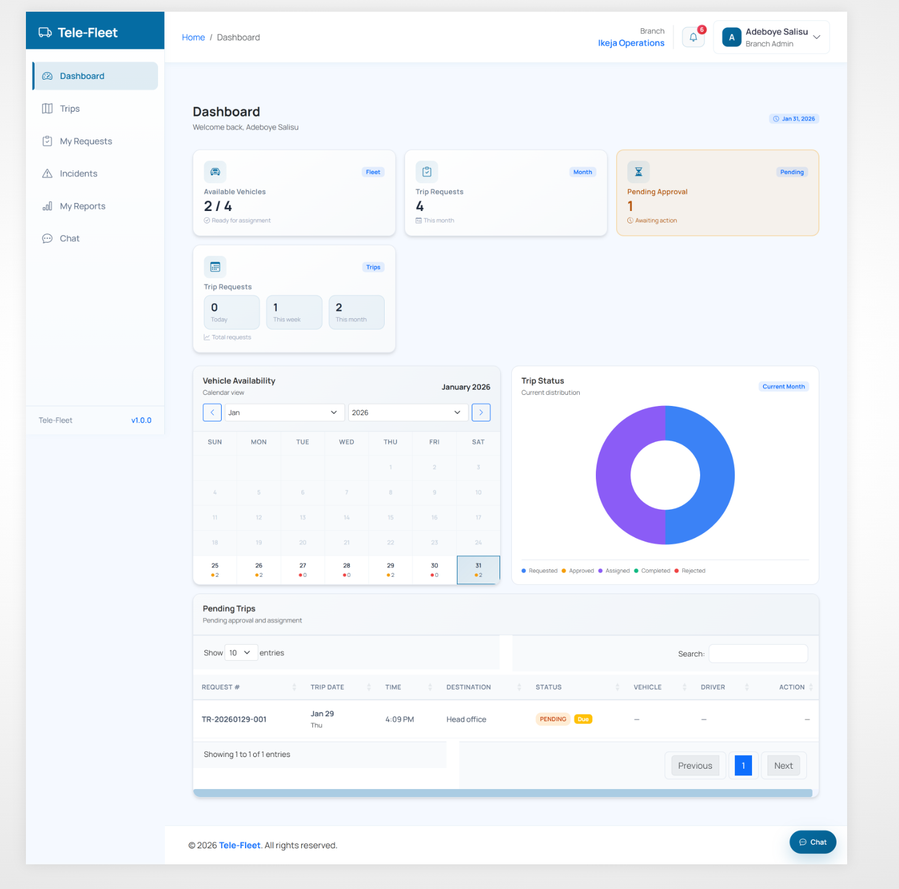

### 5.2 Branch Head
- **Cards**: Branch completion metrics and totals for the month
- **Calendar**: Branch availability forecast
- **Charts**: Trip status tracker (current month)
- **Tables**: Upcoming trips for branch (admin + head)

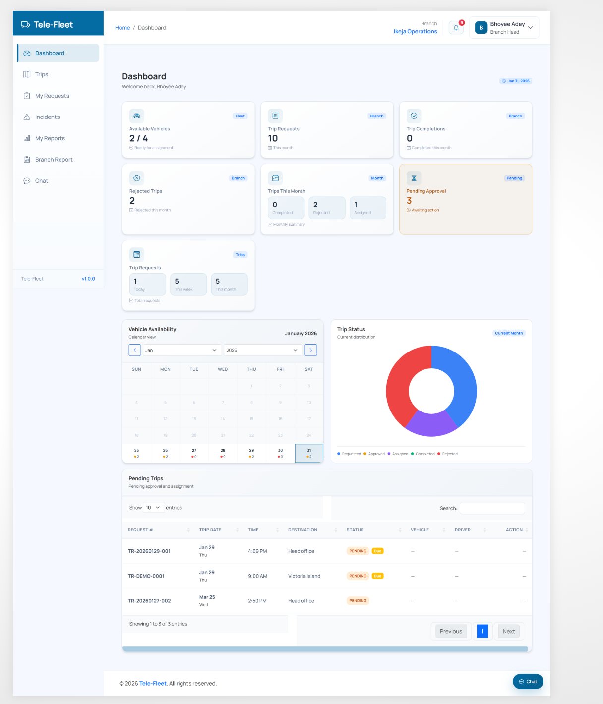

### 5.3 Fleet Manager
- **Cards**: Fleet status (available, in-use, maintenance), driver on duty, incidents, maintenance due
- **Trip Activity**: Today active, future trips, and unassigned trips
- **Charts**: Fleet status overview (vehicles, drivers, incidents, trip mix)
- **Tables**: Pending trips and operational queues

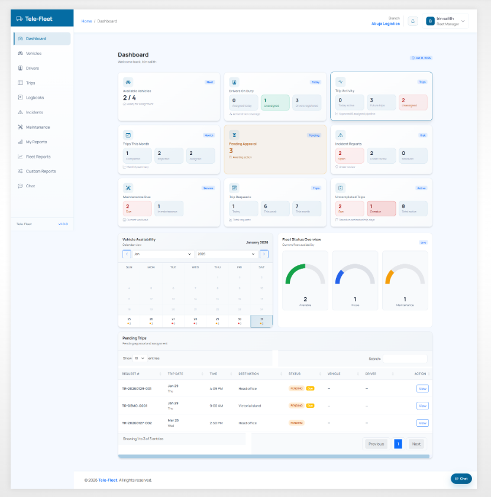

### 5.4 Super Admin
- **All Fleet Manager features**, plus:
- System health cards and alerts
- Global reporting with branch leaderboards

All dashboards use real-time updates when available and silently fall back to polling when required.

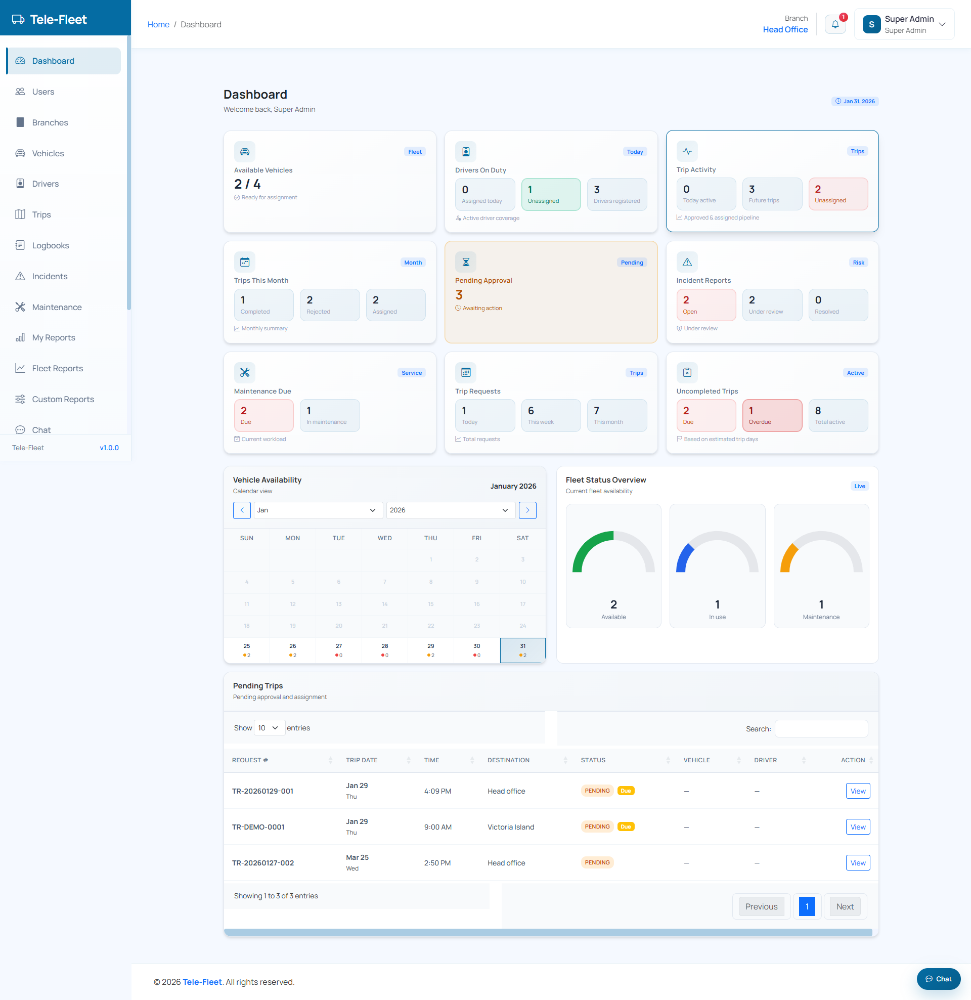

---

## 6. Trip Requests
### 6.1 Create a Trip
1. Go to **Trips** > **New Trip**.
2. Enter: purpose, destination, trip date/time, passengers, and estimated trip days.
3. Submit the request.

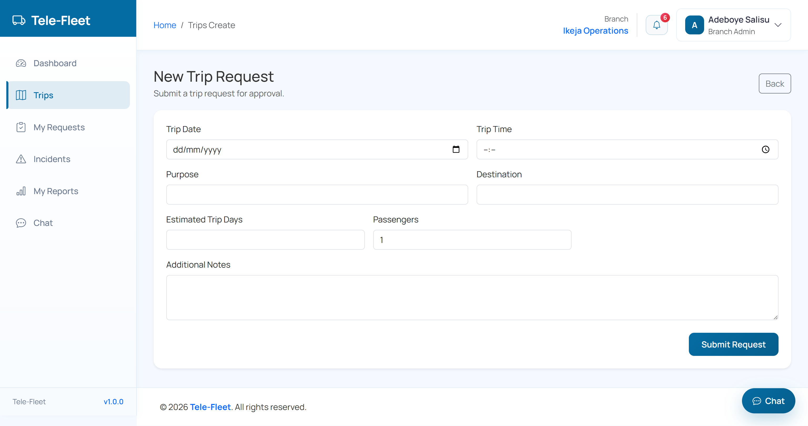

### 6.2 Track a Trip
- Status values: **Pending**, **Approved**, **Assigned**, **Completed**, **Rejected**, **Cancelled**.
- Branch Admins can edit only when status is **Pending**.
- Branch Admins can cancel **Pending** requests, or future approved trips before the trip date/time.

### 6.3 Cancel Rules
Cancel is allowed when:
- The trip is **Pending** (always), or
- The trip date/time is in the future (not completed)

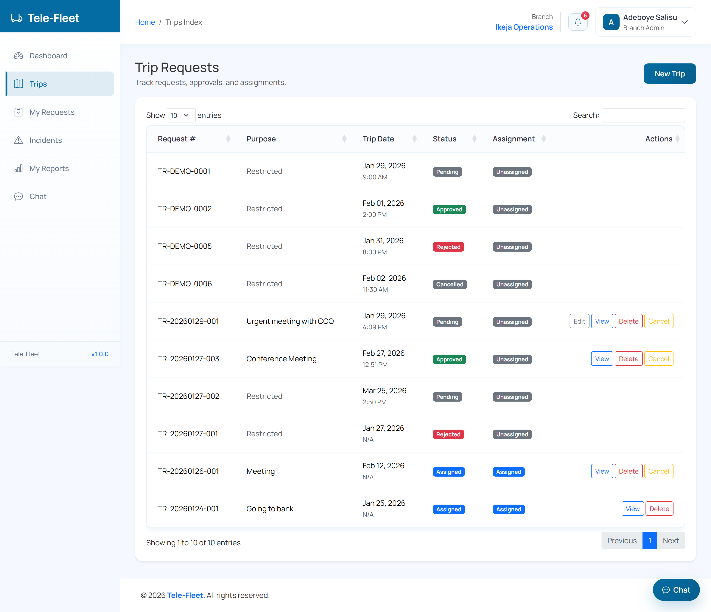

### 6.4 Manage Trips (Fleet Manager/Super Admin)
- **Edit/Update**: Open a trip and click **Edit** to update details.
- **Soft Delete**: Fleet Manager can delete any trip (soft delete removes it from normal lists).
- **Restore**: Super Admin can restore soft-deleted trips.
- **Permanent Delete**: Super Admin can permanently delete soft-deleted trips.

---

## 7. Trip Approvals and Assignment (Fleet Manager/Super Admin)
- Go to **Trips** in the sidebar (or open the **Pending Trips** table on the dashboard).
- Review pending trips and click **View** to open the trip detail screen.
- On the **Trip Details** screen:
  - Review request information (purpose, destination, date/time, passengers, estimated days).
  - **Approve** or **Reject** the request with a reason.
  - After approval, use **Assign Vehicle/Driver** to select available resources.
- If vehicles or drivers are not yet available, you can approve the trip first and assign later.
- Approved trips without assignment trigger reminders before the trip time.

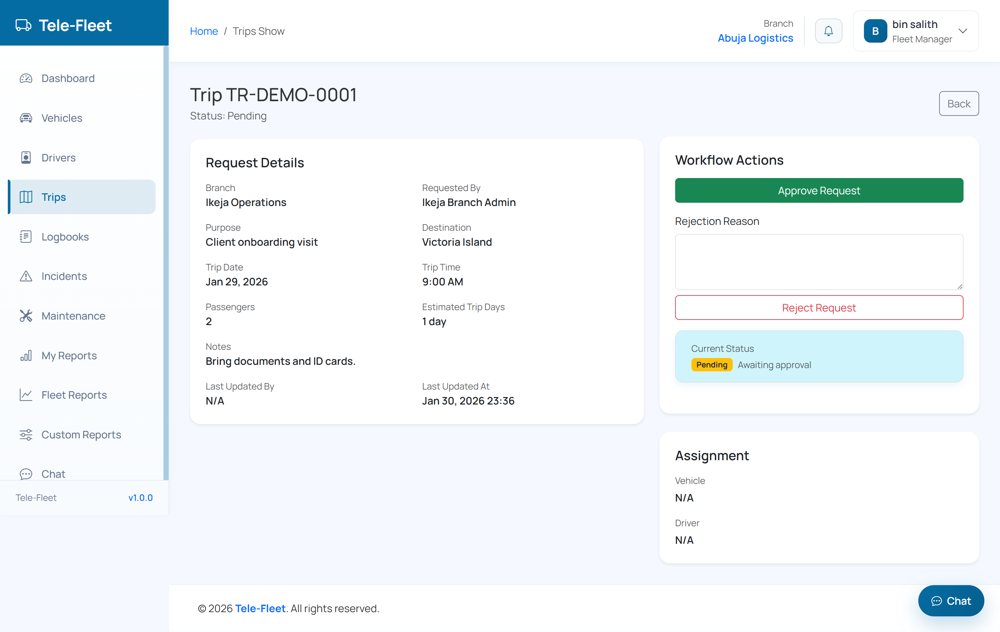

---

## 8. Trip Status, Due, and Overdue Logic
Trips are monitored against their date/time and **Estimated Trip Days**:
- **Due** indicates the trip is still open after the estimated trip days have elapsed from the trip date/time.
- **Overdue** indicates the trip is further beyond that completion window.
- Due/Overdue status appears in tables and can highlight urgent items.

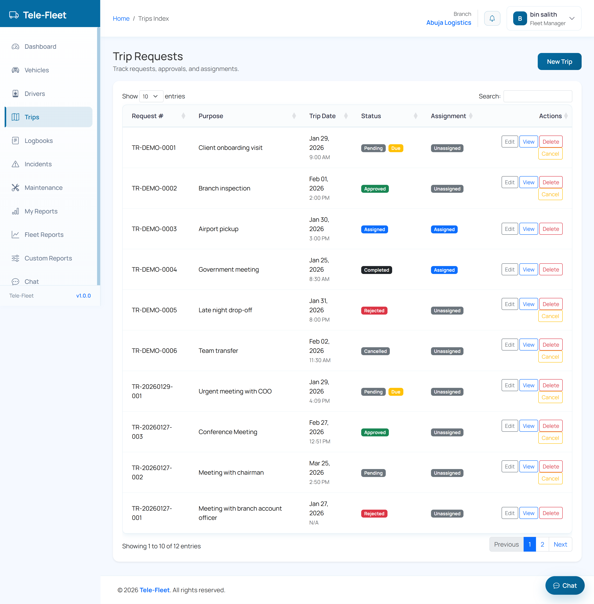

---

## 9. Logbooks
Logbooks capture trip completion details and are managed by Fleet Manager and Super Admin.

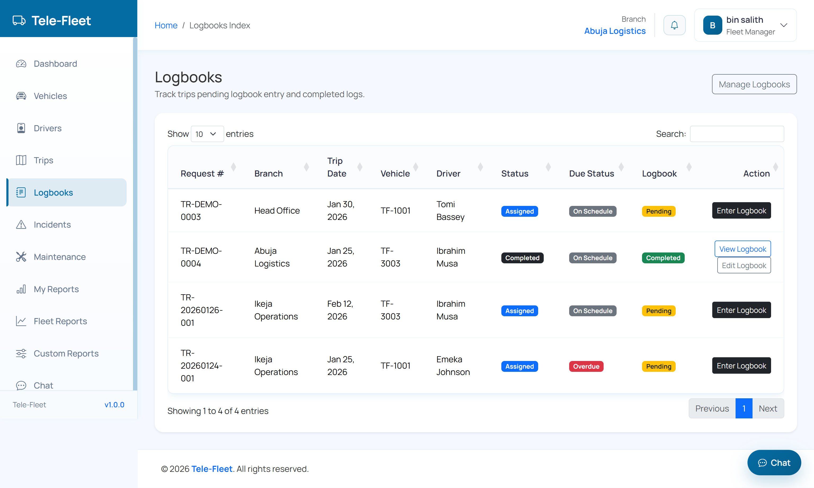

### 9.1 Accessing Logbooks
- Go to **Logbooks** in the sidebar.
- The main logbooks list shows pending and completed entries.
- Use **View Logbook** to open a specific record.

### 9.2 Creating a Logbook
1. Open a completed or assigned trip and click **Logbook**.
2. Enter trip completion details and submit.

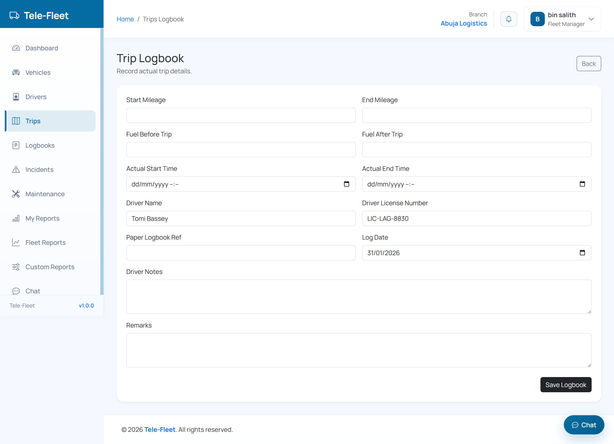

### 9.3 Managing Logbooks
- **Edit**: Fleet Manager can edit active logbooks.
- **Archive (Soft Delete)**: Fleet Manager can archive a logbook (removes it from normal lists).
- **Restore**: Super Admin can restore archived logbooks.
- **Permanent Delete**: Super Admin can permanently delete archived logbooks when required.

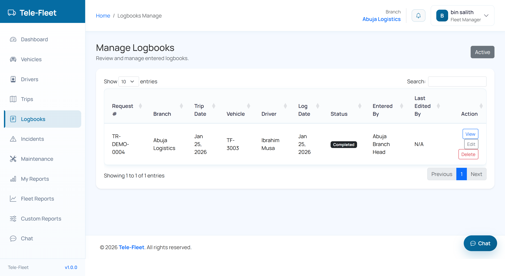
---

## 10. Incidents
### 10.1 Create an Incident
1. Navigate to **Incidents** > **New Incident**.
2. Select related trip (auto-fills vehicle/driver when applicable).
3. Fill in severity, description, date/time, and upload attachments.

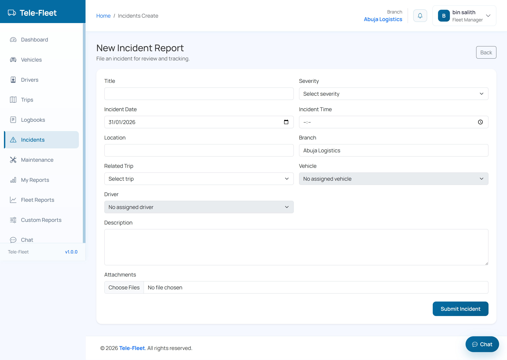

### 10.2 Status Workflow
- Open → Under Review → Resolved
- Cancelled for withdrawn incidents

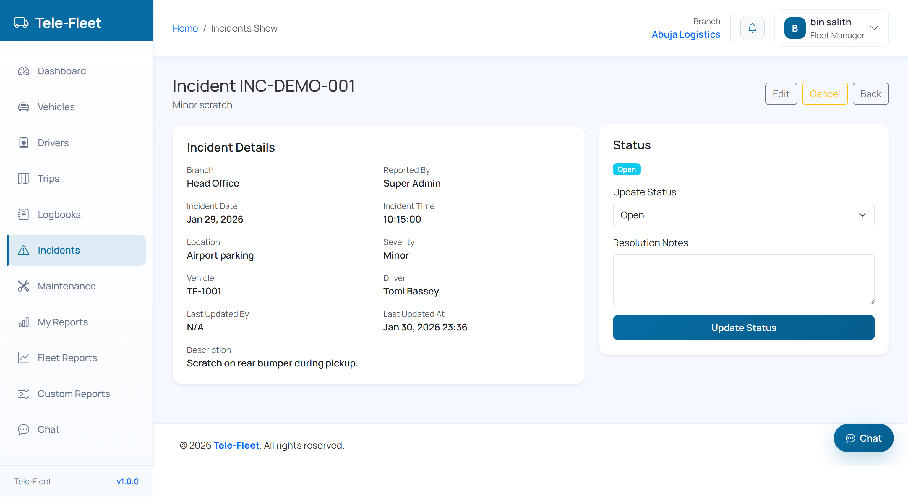

### 10.3 Manage Incidents (CRUD)
- **Create**: Incidents > New Incident.
- **View**: Open an incident to see details and attachments.
- **Edit/Update**: Only **Open** incidents can be edited.
- **Cancel**: Open incidents can be cancelled when no longer needed.
- **Soft Delete**: Fleet Manager and Super Admin can delete incidents (soft delete removes from active lists).
- **Restore**: Super Admin can restore soft-deleted incidents.
- **Permanent Delete**: Super Admin can permanently delete soft-deleted incidents.

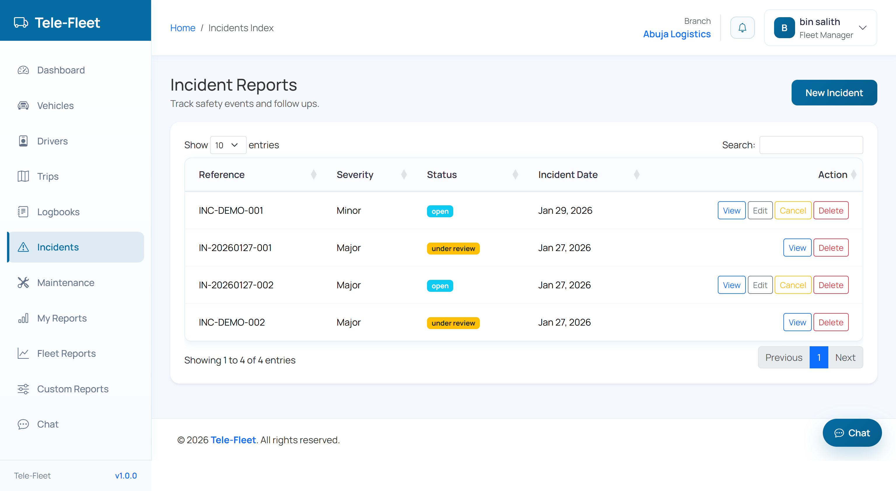

### 10.4 Visibility
- Branch users see incidents from their branch only.
- Fleet Manager and Super Admin see all incidents.

### 10.5 Attachments
- Images and documents can be previewed without download.
- Download remains available for records and sharing.

---

## 11. Vehicles
Fleet roles manage vehicle records end‑to‑end.

### 11.1 Accessing the Vehicles Page
- Go to **Vehicles** in the sidebar (Fleet Manager / Super Admin).
- Use the search, filters, or status badges to quickly locate a vehicle.

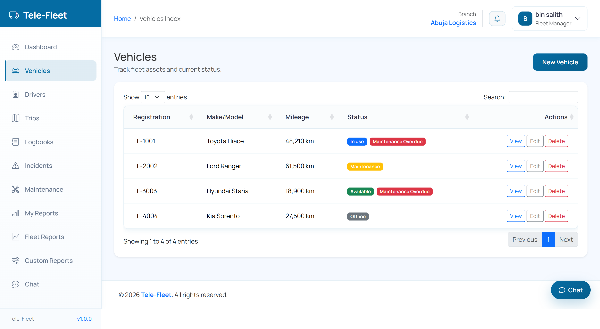

### 11.2 Create a New Vehicle
- Click **New Vehicle**.
- Fill registration, make/model, current mileage, last maintenance mileage, and status.
- Save to add the vehicle to the fleet list.

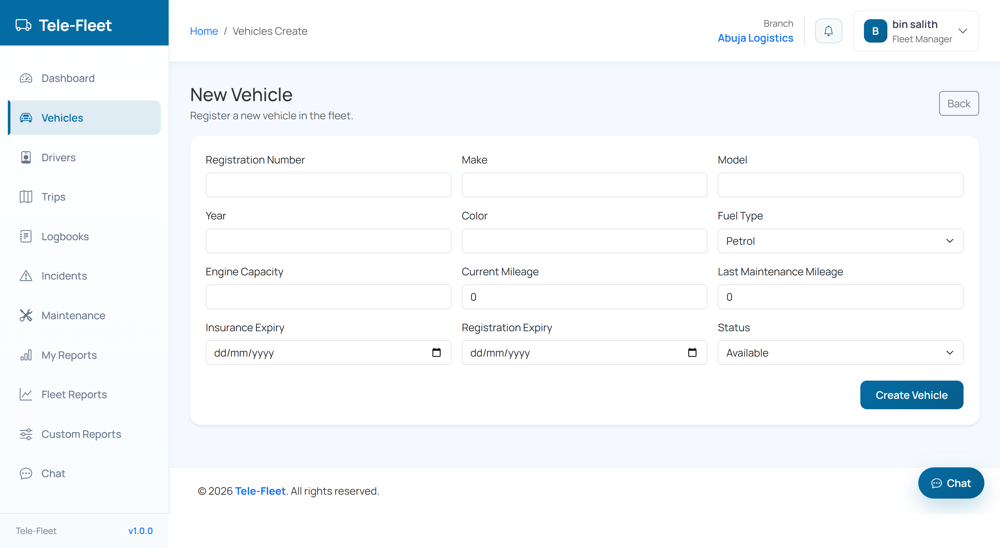

### 11.3 View Vehicle Details
- In the Vehicles table, click **View**.
- The details page shows full vehicle profile, current status, maintenance state, analytics, and active trips.

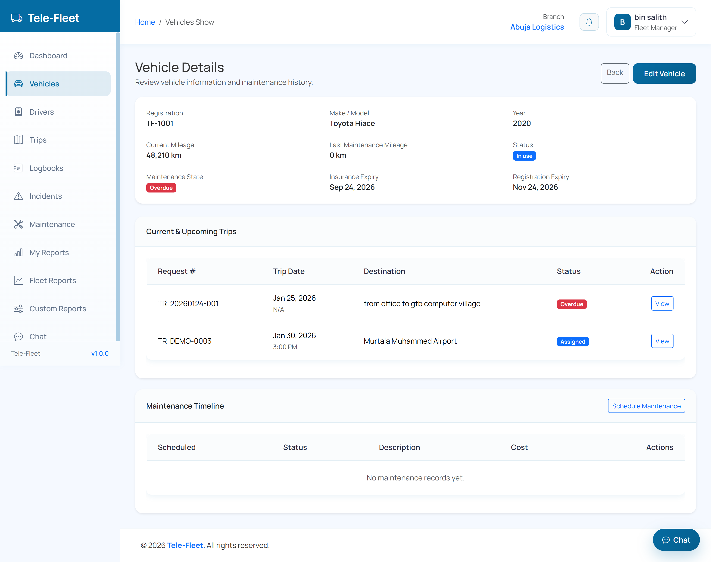

### 11.4 Edit or Update a Vehicle
- Click **Edit** on the table or from the details page.
- Update any fields (mileage, maintenance details, status).
- Save changes.

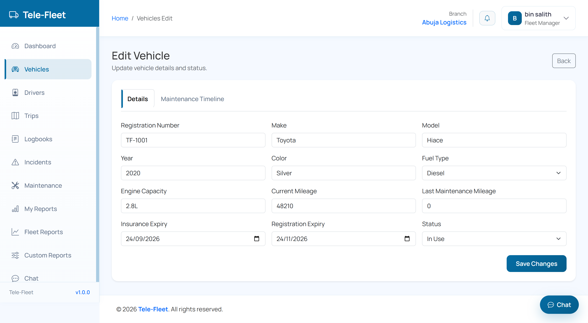

### 11.5 Delete / Restore (Soft & Hard Delete)
- **Fleet Manager**: Delete performs a **soft delete** (archive). The vehicle is removed from active lists.
- **Super Admin**: Can **restore** archived vehicles or **delete permanently** from the archive view.

### 11.6 Status & Badges
- **Vehicle Status**: Available, In Use, Maintenance, Offline
  - *Maintenance/In Use* vehicles are not assignable to trips.
- **Maintenance State**: OK, Due, Overdue
  - **Due** shows when current mileage hits 98% of the target window.
  - **Overdue** shows once the target mileage is reached/exceeded.
  - Badges appear in the status column to highlight these states.

---

## 12. Drivers
Fleet roles manage driver records end‑to‑end.

### 12.1 Accessing the Drivers Page
- Go to **Drivers** in the sidebar (Fleet Manager / Super Admin).
- Use search and status filters to find a specific driver quickly.

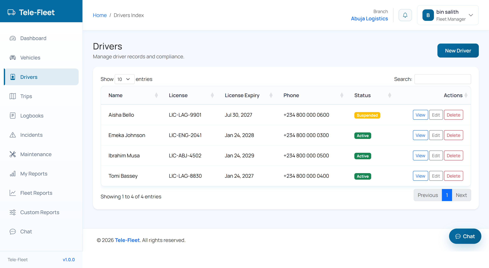
### 12.2 Create a New Driver
- Click **New Driver**.
- Enter driver name, license details, phone, and status.
- Save to add the driver to the roster.

### 12.3 View Driver Details
- In the Drivers table, click **View**.
- The details page shows full driver profile, license expiry, analytics, and active trips.

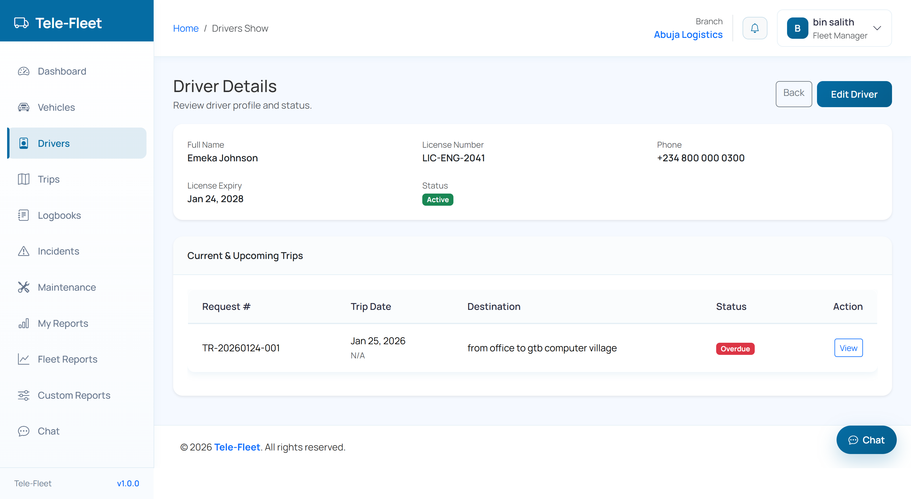

### 12.4 Edit or Update a Driver
- Click **Edit** on the table or from the details page.
- Update license expiry, status, or contact information.
- Save changes.

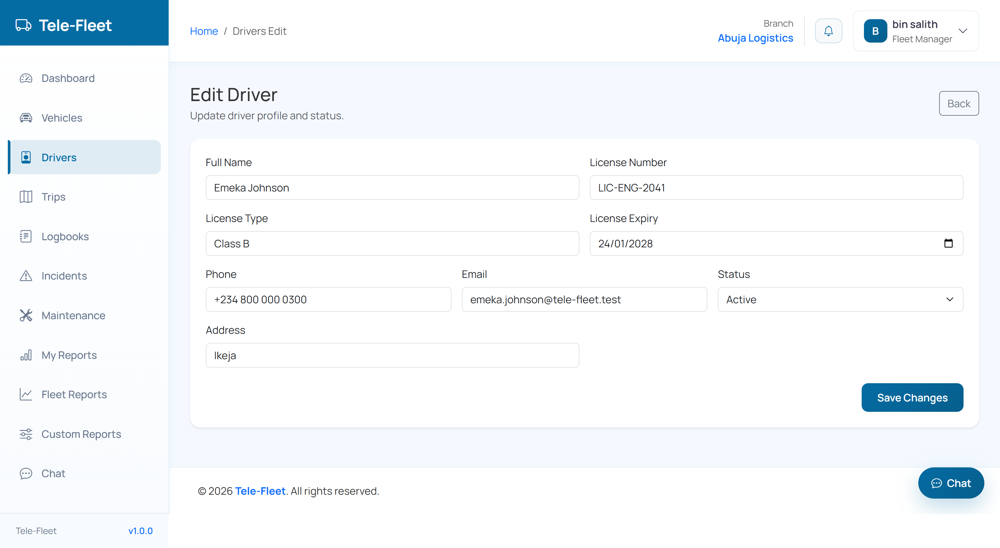

### 12.5 Delete / Restore (Soft & Hard Delete)
- **Fleet Manager**: Delete performs a **soft delete** (archive).
- **Super Admin**: Can **restore** archived drivers or **delete permanently** from the archive view.

### 12.6 Status & Assignment Rules
- **Driver Status**: Active, Inactive, Suspended
- Inactive/Suspended drivers are not assignable to trips.

---

## 13. Maintenance
Fleet roles can schedule, track, and close vehicle maintenance.

### 13.1 Accessing Maintenance
1. Go to **Maintenance** in the sidebar.
2. Use the search and filters to find specific vehicles or records.

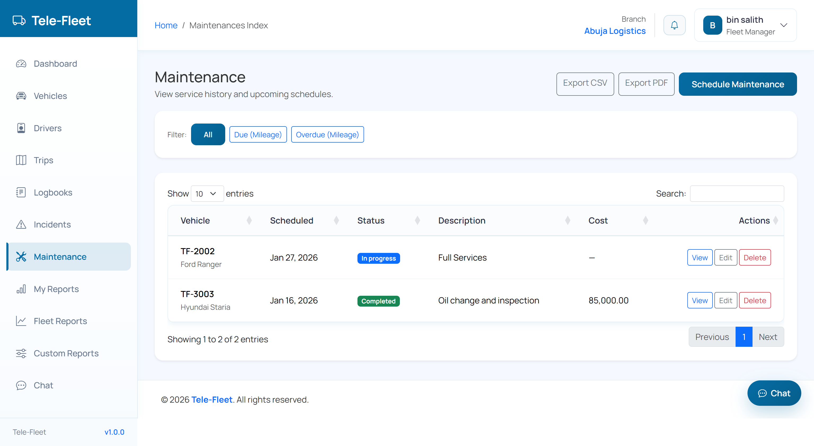

### 13.2 Schedule Maintenance
1. Click **Schedule Maintenance**.
2. Select the vehicle and enter the maintenance details.
3. Save to create the schedule.

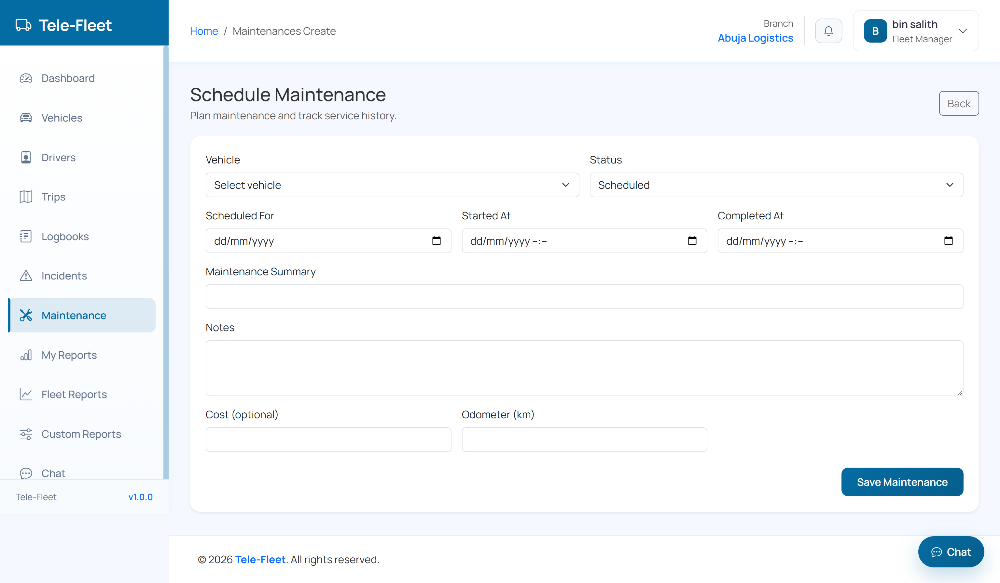

When maintenance is **In Progress**, the vehicle status is automatically set to **Maintenance** and becomes unavailable for trip assignment.

### 13.3 Status Workflow
- **Scheduled** → **In Progress** → **Completed**
- Cancelled entries are removed from active lists (soft delete).

### 13.4 View, Edit, Update
- **View**: Click on view button from the maintenance list to open a maintenance record to see full details and history.
- 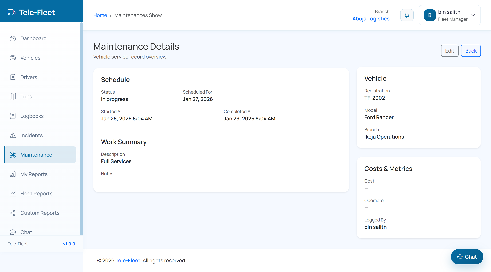
- 
- **Edit/Update**: Only active records can be updated (status, dates, notes, cost).

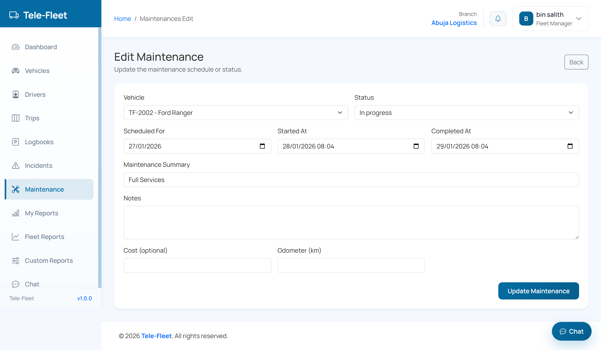

### 13.5 Delete / Restore (Soft & Hard Delete)
- **Fleet Manager**: Delete performs a **soft delete** (removes from active lists).
- **Super Admin**: Can **restore** soft-deleted records or **delete permanently**.

### 13.6 Mileage-based Due/Overdue
- A mileage target is set in **Maintenance Settings**.
- Vehicles become **Due** when current mileage reaches **98%** of the target window from last maintenance.
- Vehicles become **Overdue** once the target is reached or exceeded.
- On completion, **last maintenance mileage** is set to the current mileage.

### 13.7 Filters and Exports
- Filter by **Due** or **Overdue** to prioritize urgent vehicles.
- Export maintenance data to **CSV** or **PDF** for reporting.

---

## 14. Reports
### 14.1 My Reports (Branch Users)
1. Go to **My Reports** in the sidebar.
2. Use the date range or quick filters to narrow results.
3. Review the cards and table:
   - **Cards** summarize trip totals and key statuses for the selected range.
   - **Table** shows detailed trip history (request number, date, status).
4. Use **Export CSV** or **Export PDF** to download the report.

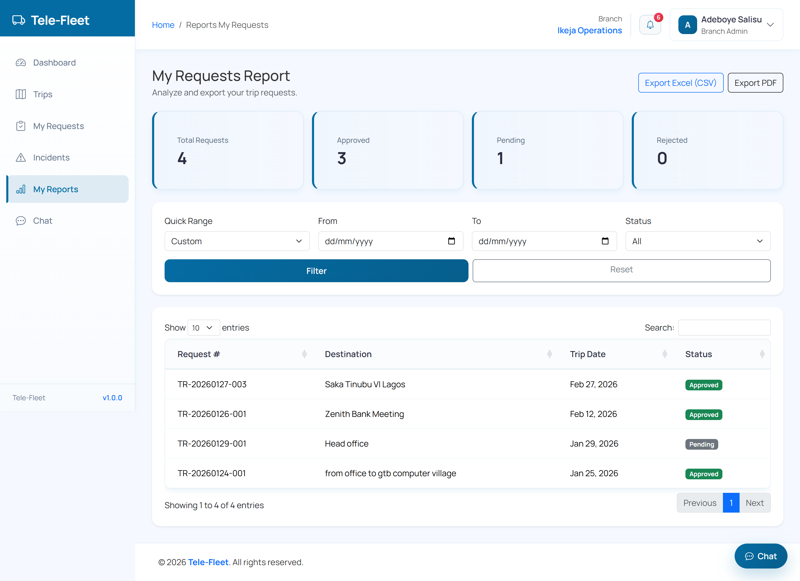

### 14.2 Branch Report (Branch Head)
1. Go to **Branch Report** in the sidebar.
2. Use filters to select the period you want to analyze.
3. Review the report content:
   - **Cards** show branch totals (combined branch head + branch admins).
   - **Table** lists branch-level trips and activity.
4. Use **Export CSV** or **Export PDF** to download a branch report labeled with the branch name.

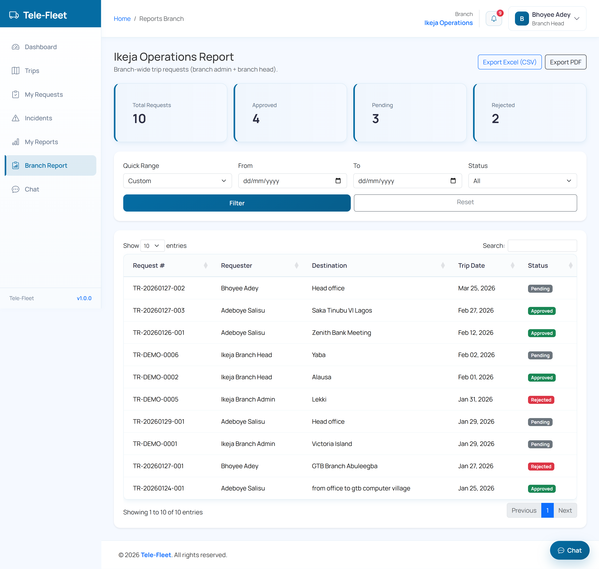

### 14.3 Fleet Reports (Fleet Manager/Super Admin)
1. Go to **Fleet Reports** in the sidebar.
2. Use the **Quick Range** or **From/To** date filters to set the reporting period.
3. Optionally filter by **Branch** to focus on a specific location.
4. Review the content by tab:
   - **Overview**: Summary cards (trips, approvals, completion rate, vehicles, drivers, incidents, maintenance) and charts.
   - **Trips**: Trip status mix, trip history table, and totals for the range.
   - **Vehicles**: Fleet status cards and a table of vehicles with maintenance state.
   - **Drivers**: Driver status cards and a table with license expiry and trip counts.
   - **Incidents**: Incident status cards and incident history table.
   - **Maintenance**: Maintenance status cards and maintenance schedule history.
5. Use **Export CSV** or **Export PDF** to download the full report for the selected range.

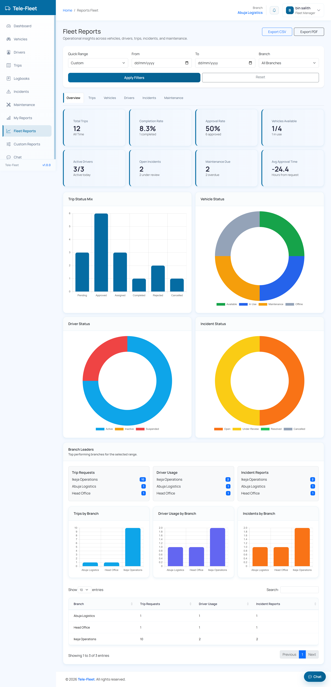

### 14.4 Custom Reports
1. Go to **Custom Reports** in the sidebar.
2. Choose the **Module** you want to report on (Trips, Vehicles, Drivers, Incidents, Maintenance).
3. Select a **Branch** (optional) to narrow the report.
4. Set the **date range** to define the reporting window.
5. Review the table results for the selected filters.
6. Use **Export CSV** or **Export PDF** to download the report.

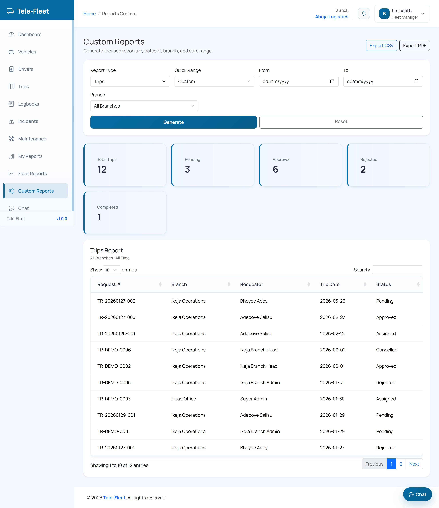

---

## 15. Notifications
- In-app bell icon shows **unread** notifications only.
- Trip notifications include trip request number for clarity.
- Chat notifications are limited to support request creation and chat closure.
- Email notifications mirror key in-app events (approvals, rejections, incidents, reminders).

---

## 16. Chat Support
Chat is a support channel between **Branch Admin/Branch Head** and the **Fleet Manager/Super Admin** team.

### 16.1 Who Can Chat With Who
- Branch Admin and Branch Head can only chat with **Fleet Manager** or **Super Admin**.
- Branch Admins **cannot** chat with Branch Heads (and vice‑versa).

### 16.2 Start a Support Chat (Branch Users)
1. Open **Chat** from the sidebar (or chat widget).
2. Select the **issue type** (Administrative or Technical).
3. Click **Request Support**.
4. You will see a “Support request sent” message while waiting.

### 16.3 Accept and Respond (Fleet Manager / Super Admin)
1. Open **Chat** and select the pending request.
2. Click **Accept** to open the conversation.
3. Send the first response to start the thread.

### 16.4 Conversation Status
- **Pending**: Request sent, waiting for acceptance.
- **Active**: Accepted and ready for messages.
- **Closed**: Conversation ended by Fleet Manager/Super Admin.

### 16.5 History and Visibility
- Closed chats appear under **History**.
- Users can **soft delete** history items (hide from their list).
- Super Admin can still view all conversations.

---

## 17. System Tools (Super Admin)
### 17.1 System Health

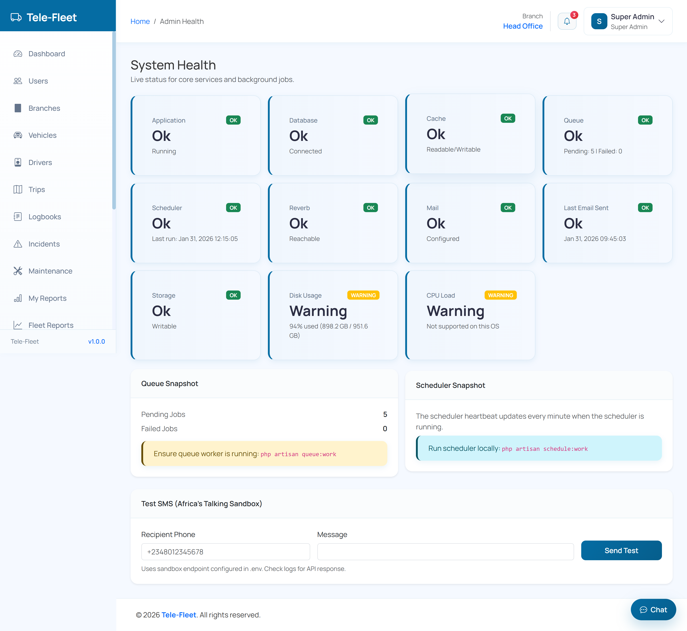

- The **System Health** page shows live operational checks so Super Admins can verify the app is running normally.
- Cards include:
  - **Queue**: Shows pending and failed jobs. If failed jobs grow, run the queue worker or review failed jobs.
  - **Scheduler**: Confirms scheduled tasks are running and when the last heartbeat was seen.
  - **Broadcasting**: Confirms Reverb/WebSocket connectivity for realtime updates.
  - **System Metrics**: Quick view of disk usage, CPU load, and last email status.
  - **SMS Test (Africa’s Talking Sandbox)**: Send a test SMS to validate credentials and API connectivity.

**How to monitor**
1. Open **System Health** from the sidebar.
2. Review card statuses (OK/WARNING/ERROR).
3. Click into the related tool page (Backups/Logs) if you need deeper inspection.

**When to seek help**
- If Queue shows **Failed** jobs or Scheduler shows **Heartbeat missing**, notify the development team.
- If Broadcasting shows **Not reachable**, realtime updates may fall back to polling and chat may delay.
- If SMS Test returns authentication errors, verify the API key and username configuration.

### 17.2 Database Backups
- Super Admins can run **manual backups** on demand.
- Backup jobs also run **automatically every day at 2:00 AM** (server time).
- Auto-cleanup keeps only the **latest 7 backups** to save storage.

### 17.3 System Logs
- The **System Logs** page helps Super Admins review recent system activity and errors.

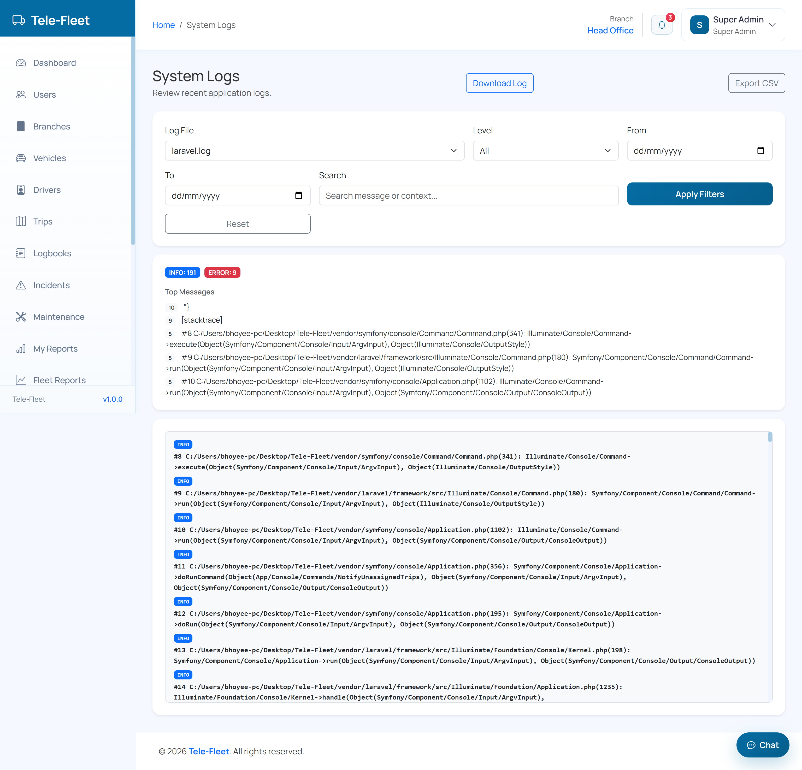

**How to use**
1. Open **System Logs** from the sidebar.
2. Select the log file by date.
3. Use filters (level/date/keyword) to narrow results.
4. Download the log file for audits or troubleshooting.

**What to monitor**
- Repeated **ERROR** or **CRITICAL** entries.
- Queue failures, SMS/API failures, or missing scheduler heartbeats.
- Frequent permission/authorization errors (403/401).

**When to seek help**
- Persistent errors that repeat after refresh.
- Failed jobs increasing without resolution.
- Any log showing data access outside allowed branches.

---

## 18. Data Privacy and Branch Isolation
- Branch data is isolated for branch roles.
- Fleet Manager and Super Admin have global visibility.
- Reports, incidents, and notifications follow branch visibility rules.

---

## 19. Troubleshooting
- **Slow response**: Wait briefly or refresh the page.
- **Permission errors**: Confirm your role and branch.
- **Missing chat updates**: Verify the broadcast service is running.
- **Notifications not updating**: Check real-time connection or refresh.
- **Backups failing**: Ensure database credentials and mysqldump path are valid.

For unresolved issues, contact the system administrator.

---

## 20. Background Services
Tele-Fleet relies on a few background services to keep data fresh and notifications timely.

### 20.1 Queue Worker
- **Purpose**: Processes queued jobs such as notifications (email/SMS) and scheduled reminders.
- **Expected state**: Running continuously in production.
- **Symptoms if down**: Notifications delayed or missing; queue backlog grows.

### 20.2 Scheduler
- **Purpose**: Runs scheduled tasks (reminders, maintenance checks, status updates).
- **Expected state**: Runs every minute via system scheduler or `php artisan schedule:work`.
- **Symptoms if down**: Due/overdue checks and automated reminders stop updating.

### 20.3 Realtime/Broadcast Server (Reverb)
- **Purpose**: Delivers real-time updates (chat, live dashboards).
- **Expected state**: Running and reachable.
- **Symptoms if down**: Realtime updates stop; system falls back to silent polling.

If any service shows errors (e.g., queue warnings, broadcast disconnected), notify the development team.
